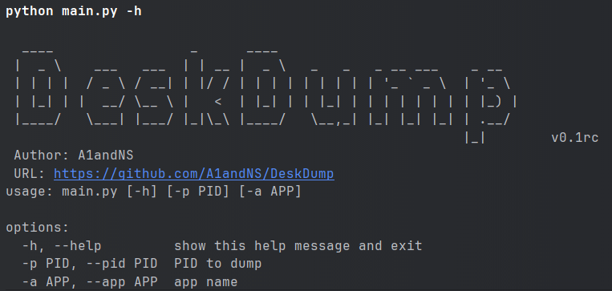
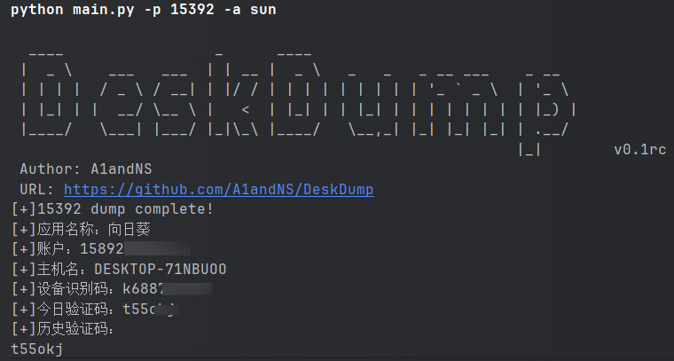

# DeskDump
DeskDump用于提取向日葵和ToDesk程序的设备识别码和连接验证码。主要核心原理是通过向日葵或ToDesk程序的PID，借助procdump提取相关进程的内存数据，随后在内存数据中进行正则匹配来提取设备识别码和临时验证码。

## 欢迎Star和二次开发，后续会继续补全更新
## 组件
Tools中包含用于进程信息提取的procdump。
main.py中是主要实现程序，目前只支持向日葵的识别码和验证码提取。

## 使用
请使用python3！

`python main.py -p $PID$ -a sun`

## 效果
向日葵：

ToDesk:

